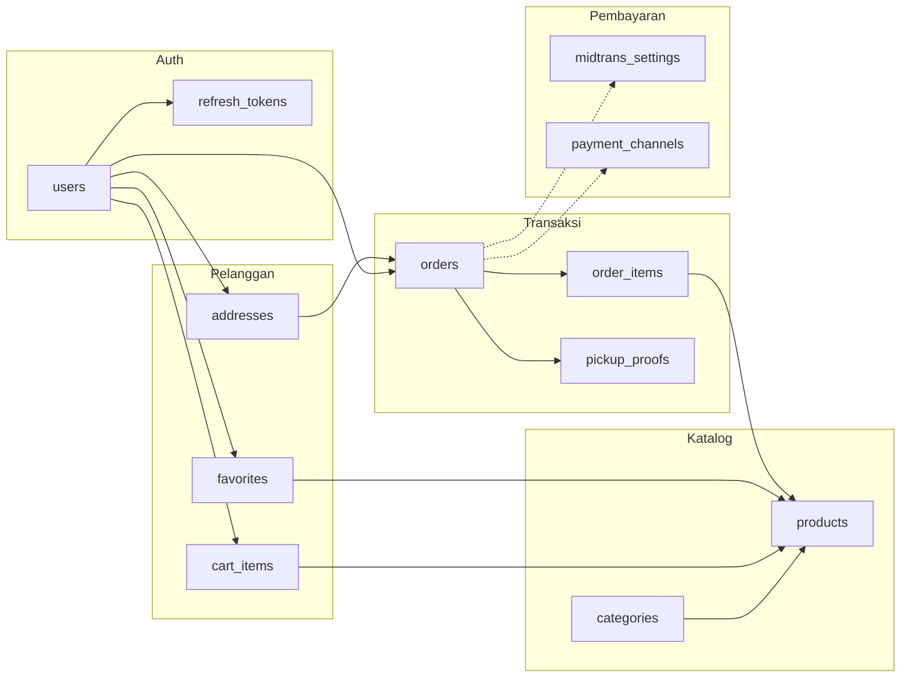
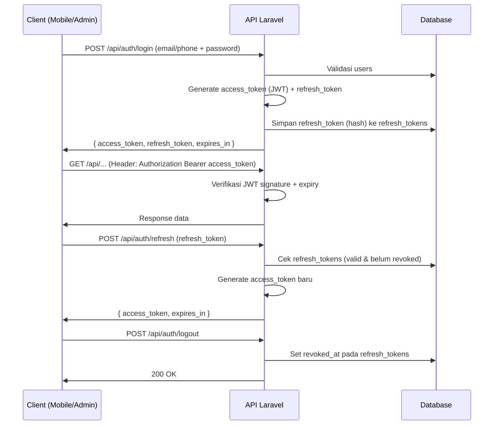
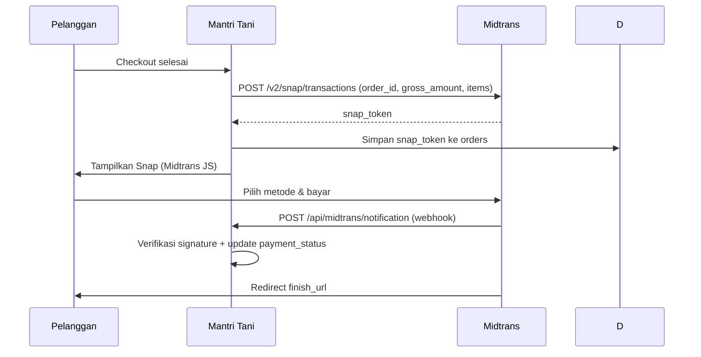
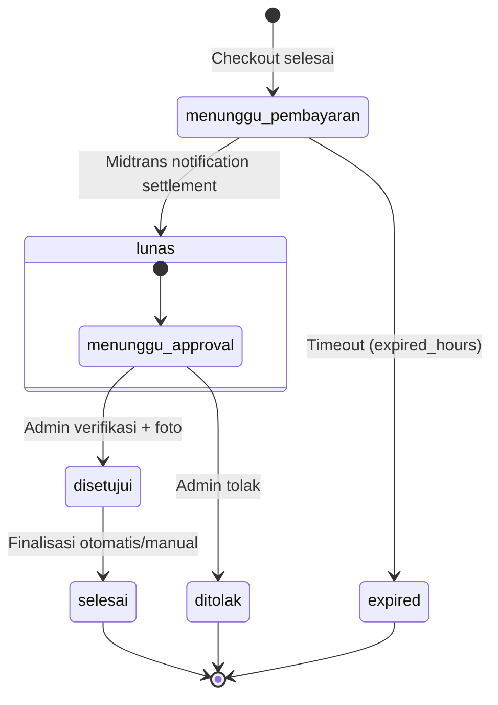

# ERD — Mantri Tani

Entity Relationship Diagram untuk database **Mantri Tani**, dirancang berdasarkan tampilan UI yang sudah ada (mobile store, admin panel, owner panel).

**Versi:** 1.3  
**Tanggal:** 7 Juli 2026  
**Stack:** Laravel 12 · MySQL/SQLite · JWT Auth · Midtrans Snap

> **Diagram:** [`planning/ERD.puml`](ERD.puml) (ERD) · [`planning/FLOWCHART.puml`](FLOWCHART.puml) (flowchart) · [`planning/ERD.plantuml.md`](ERD.plantuml.md)

---

## Diagram Relasi

```mermaid
erDiagram
    users {
        bigint id PK
        string name
        string email UK
        string phone UK
        string password
        enum role "customer|admin|owner"
        timestamp email_verified_at
        timestamps created_at_updated_at
    }

    refresh_tokens {
        bigint id PK
        bigint user_id FK
        string token_hash UK
        timestamp expires_at
        timestamp revoked_at
        timestamps created_at
    }

    categories {
        bigint id PK
        string name
        string slug UK
        string icon
        string color
        text description
        int display_order
        boolean is_active
        timestamps created_at_updated_at
    }

    products {
        bigint id PK
        bigint category_id FK
        string name
        string slug UK
        text description
        decimal price
        int stock
        string emoji
        string image_path
        string badge
        enum status "active|draft"
        timestamps created_at_updated_at
    }

    addresses {
        bigint id PK
        bigint user_id FK
        string label
        string recipient_name
        string phone
        string street
        string district
        boolean is_default
        timestamps created_at_updated_at
    }

    cart_items {
        bigint id PK
        bigint user_id FK
        bigint product_id FK
        int quantity
        boolean is_selected
        timestamps created_at_updated_at
    }

    orders {
        bigint id PK
        string code UK
        bigint user_id FK
        bigint address_id FK
        string buyer_name
        string buyer_phone
        decimal subtotal
        decimal admin_fee
        decimal total
        enum payment_status
        enum pickup_status
        string payment_method
        string midtrans_order_id
        string midtrans_transaction_id
        string snap_token
        timestamp paid_at
        timestamp expired_at
        timestamps created_at_updated_at
    }

    order_items {
        bigint id PK
        bigint order_id FK
        bigint product_id FK
        string product_name
        decimal unit_price
        int quantity
        decimal subtotal
    }

    pickup_proofs {
        bigint id PK
        bigint order_id FK UK
        bigint verified_by FK
        string photo_path
        text note
        timestamp verified_at
    }

    midtrans_settings {
        bigint id PK
        string server_key
        string client_key
        enum mode "sandbox|production"
        string notification_url
        string finish_url
        string unfinish_url
        string error_url
        int expiry_duration
        boolean is_active
        timestamps updated_at
    }

    payment_channels {
        bigint id PK
        string code UK
        string name
        enum group "qris|va|ewallet"
        string icon
        string color
        boolean is_enabled
    }

    favorites {
        bigint id PK
        bigint user_id FK
        bigint product_id FK
        timestamps created_at
    }

    activity_logs {
        bigint id PK
        bigint user_id FK
        string action
        string subject_type
        bigint subject_id
        text description
        timestamps created_at
    }

    users ||--o{ refresh_tokens : "JWT refresh"
    users ||--o{ addresses : memiliki
    users ||--o{ cart_items : memiliki
    users ||--o{ orders : memesan
    users ||--o{ favorites : menyimpan
    users ||--o{ activity_logs : melakukan
    users ||--o{ pickup_proofs : memverifikasi

    categories ||--o{ products : berisi

    products ||--o{ cart_items : ada_di
    products ||--o{ order_items : dipesan
    products ||--o{ favorites : difavoritkan

    addresses ||--o{ orders : digunakan

    orders ||--|{ order_items : berisi
    orders ||--o| pickup_proofs : bukti_pengambilan
```

---

## Diagram Alur Data Utama



---

## Definisi Tabel

### 1. `users`

Akun untuk ketiga role: pelanggan (toko), admin, dan owner.

| Kolom | Tipe | Constraint | Keterangan |
|-------|------|------------|------------|
| `id` | BIGINT UNSIGNED | PK, AUTO_INCREMENT | — |
| `name` | VARCHAR(255) | NOT NULL | Nama lengkap |
| `email` | VARCHAR(255) | UNIQUE, NULLABLE | Login pelanggan/admin |
| `phone` | VARCHAR(20) | UNIQUE, NULLABLE | WhatsApp / HP (register, checkout) |
| `password` | VARCHAR(255) | NOT NULL | Hash bcrypt |
| `role` | ENUM | NOT NULL, DEFAULT `customer` | `customer`, `admin`, `owner` |
| `email_verified_at` | TIMESTAMP | NULLABLE | — |
| `created_at` | TIMESTAMP | — | — |
| `updated_at` | TIMESTAMP | — | — |

**Metode login (semua role):** email atau no. handphone + password.

| Role | Guard | Middleware |
|------|-------|------------|
| `customer` | `api` (JWT) | `auth:api` / `jwt.auth` |
| `admin` | `api` (JWT) | `auth:api` + `role:admin` |
| `owner` | `api` (JWT) | `auth:api` + `role:owner` |

**Sumber UI:** login, register, profil, checkout (data pembeli), admin layout.

---

### 2. `refresh_tokens`

Menyimpan refresh token JWT untuk perpanjangan sesi dan logout (revoke).

| Kolom | Tipe | Constraint | Keterangan |
|-------|------|------------|------------|
| `id` | BIGINT UNSIGNED | PK, AUTO_INCREMENT | — |
| `user_id` | BIGINT UNSIGNED | FK → users.id | Pemilik token |
| `token_hash` | VARCHAR(255) | UNIQUE, NOT NULL | Hash SHA-256 refresh token |
| `expires_at` | TIMESTAMP | NOT NULL | Masa berlaku refresh token |
| `revoked_at` | TIMESTAMP | NULLABLE | Diisi saat logout / token diganti |
| `created_at` | TIMESTAMP | — | — |

**Relasi:** `user_id` → `users.id` (ON DELETE CASCADE)

**Catatan:** Access token (JWT) **tidak disimpan di DB** — stateless, expire pendek (15–60 menit). Hanya refresh token yang persisten.

---

## Autentikasi JWT

**Package:** `tymon/jwt-auth` (atau `php-open-source-saver/jwt-auth` untuk Laravel 12)



**Konfigurasi `.env`:**

```env
JWT_SECRET=           # php artisan jwt:secret
JWT_TTL=60            # access token: 60 menit
JWT_REFRESH_TTL=20160 # refresh token: 14 hari (menit)
```

**API Routes (rencana):**

| Method | URI | Fungsi | Auth |
|--------|-----|--------|------|
| POST | `/api/auth/register` | Daftar customer | — |
| POST | `/api/auth/login` | Login (semua role) | — |
| POST | `/api/auth/refresh` | Perpanjang access token | refresh_token |
| POST | `/api/auth/logout` | Revoke refresh token | JWT |
| GET | `/api/auth/me` | Profil user login | JWT |

**Payload JWT (claims):**

```json
{
  "sub": 1,
  "role": "customer",
  "iat": 1750000000,
  "exp": 1750003600
}
```

**Penyimpanan token di client (Blade/mobile):**

| Token | Penyimpanan | Keterangan |
|-------|-------------|------------|
| `access_token` | Memory / sessionStorage | Dikirim via `Authorization: Bearer` |
| `refresh_token` | httpOnly cookie | Aman dari XSS |

**Middleware lama `toko.auth` (session)** akan diganti dengan validasi JWT saat backend diimplementasi.

---

### 3. `categories`

Kategori produk pertanian.

| Kolom | Tipe | Constraint | Keterangan |
|-------|------|------------|------------|
| `id` | BIGINT UNSIGNED | PK, AUTO_INCREMENT | — |
| `name` | VARCHAR(100) | NOT NULL | Pupuk, Benih, Obat Tanaman, Alat Tani |
| `slug` | VARCHAR(100) | UNIQUE, NOT NULL | pupuk, benih, obat-tanaman, alat-tani |
| `icon` | VARCHAR(10) | NOT NULL | Emoji: 🌱 🌾 💊 🔧 |
| `color` | VARCHAR(7) | NOT NULL | Hex: #059669, #d97706, dll. |
| `description` | TEXT | NULLABLE | Deskripsi kategori |
| `display_order` | INT | DEFAULT 0 | Urutan tampil (form kategori) |
| `is_active` | BOOLEAN | DEFAULT TRUE | Toggle aktif/nonaktif |
| `created_at` | TIMESTAMP | — | — |
| `updated_at` | TIMESTAMP | — | — |

**Sumber UI:** `/admin/kategori`, `/toko/kategori`, filter chip beranda.

---

### 4. `products`

Katalog produk toko.

| Kolom | Tipe | Constraint | Keterangan |
|-------|------|------------|------------|
| `id` | BIGINT UNSIGNED | PK, AUTO_INCREMENT | — |
| `category_id` | BIGINT UNSIGNED | FK → categories.id | — |
| `name` | VARCHAR(255) | NOT NULL | Pupuk Urea 50kg, Benih Cabai F1, dll. |
| `slug` | VARCHAR(255) | UNIQUE, NOT NULL | pupuk-urea-50kg |
| `description` | TEXT | NULLABLE | Deskripsi di detail produk |
| `price` | DECIMAL(12,2) | NOT NULL | Harga jual (Rp) |
| `stock` | INT UNSIGNED | DEFAULT 0 | Stok tersedia |
| `emoji` | VARCHAR(10) | NULLABLE | Fallback icon: 🌱 🌾 💊 |
| `image_path` | VARCHAR(255) | NULLABLE | Upload gambar produk |
| `badge` | VARCHAR(20) | NULLABLE | Baru, Promo, Terlaris |
| `status` | ENUM | DEFAULT `active` | `active`, `draft` |
| `created_at` | TIMESTAMP | — | — |
| `updated_at` | TIMESTAMP | — | — |

**Relasi:** `category_id` → `categories.id` (ON DELETE RESTRICT)

**Sumber UI:** beranda, detail produk, admin produk index/create, keranjang.

---

### 5. `addresses`

Alamat pembeli untuk verifikasi identitas saat pengambilan.

| Kolom | Tipe | Constraint | Keterangan |
|-------|------|------------|------------|
| `id` | BIGINT UNSIGNED | PK, AUTO_INCREMENT | — |
| `user_id` | BIGINT UNSIGNED | FK → users.id | Pemilik alamat |
| `label` | VARCHAR(50) | NOT NULL | Rumah, Kebun, Kantor |
| `recipient_name` | VARCHAR(255) | NOT NULL | Nama penerima |
| `phone` | VARCHAR(20) | NOT NULL | No. handphone |
| `street` | TEXT | NOT NULL | Jl, RT/RW, Dusun |
| `district` | VARCHAR(255) | NOT NULL | Kecamatan, Kota, Kode pos |
| `is_default` | BOOLEAN | DEFAULT FALSE | Alamat utama (checkout) |
| `created_at` | TIMESTAMP | — | — |
| `updated_at` | TIMESTAMP | — | — |

**Relasi:** `user_id` → `users.id` (ON DELETE CASCADE)

**Sumber UI:** `/toko/alamat`, checkout (address-card), approval (alamat pembeli).

---

### 6. `cart_items`

Item keranjang belanja per pelanggan.

| Kolom | Tipe | Constraint | Keterangan |
|-------|------|------------|------------|
| `id` | BIGINT UNSIGNED | PK, AUTO_INCREMENT | — |
| `user_id` | BIGINT UNSIGNED | FK → users.id | — |
| `product_id` | BIGINT UNSIGNED | FK → products.id | — |
| `quantity` | INT UNSIGNED | DEFAULT 1 | Jumlah item |
| `is_selected` | BOOLEAN | DEFAULT TRUE | Checkbox di keranjang |
| `created_at` | TIMESTAMP | — | — |
| `updated_at` | TIMESTAMP | — | — |

**Relasi:**
- `user_id` → `users.id` (ON DELETE CASCADE)
- `product_id` → `products.id` (ON DELETE CASCADE)

**Constraint:** UNIQUE (`user_id`, `product_id`)

**Sumber UI:** `/toko/keranjang` (Pupuk Urea ×2, Benih Cabai ×1).

---

### 7. `orders`

Transaksi / pesanan pelanggan.

| Kolom | Tipe | Constraint | Keterangan |
|-------|------|------------|------------|
| `id` | BIGINT UNSIGNED | PK, AUTO_INCREMENT | — |
| `code` | VARCHAR(20) | UNIQUE, NOT NULL | TRX-001, TRX-002, … |
| `user_id` | BIGINT UNSIGNED | FK → users.id | Pelanggan |
| `address_id` | BIGINT UNSIGNED | FK → addresses.id, NULLABLE | Alamat saat checkout |
| `buyer_name` | VARCHAR(255) | NOT NULL | Snapshot nama pembeli |
| `buyer_phone` | VARCHAR(20) | NOT NULL | Snapshot no. HP |
| `subtotal` | DECIMAL(12,2) | NOT NULL | Total item sebelum biaya admin |
| `admin_fee` | DECIMAL(12,2) | DEFAULT 0 | Biaya admin (Rp 2.500) |
| `total` | DECIMAL(12,2) | NOT NULL | Total akhir |
| `payment_status` | ENUM | NOT NULL | Lihat enum di bawah |
| `pickup_status` | ENUM | NOT NULL | Lihat enum di bawah |
| `payment_method` | VARCHAR(50) | NULLABLE | qris, bank_transfer, gopay, shopeepay, dll. |
| `midtrans_order_id` | VARCHAR(100) | NULLABLE | Order ID dikirim ke Midtrans (biasanya = `code`) |
| `midtrans_transaction_id` | VARCHAR(100) | NULLABLE | Transaction ID dari notifikasi Midtrans |
| `snap_token` | VARCHAR(255) | NULLABLE | Token Snap untuk halaman pembayaran |
| `paid_at` | TIMESTAMP | NULLABLE | Waktu pembayaran lunas (status `settlement`) |
| `expired_at` | TIMESTAMP | NULLABLE | Batas waktu bayar |
| `created_at` | TIMESTAMP | — | Tanggal transaksi |
| `updated_at` | TIMESTAMP | — | — |

**Enum `payment_status`:**

| Nilai | Label UI |
|-------|----------|
| `menunggu_pembayaran` | Pending |
| `lunas` | Lunas |
| `expired` | Expired |

**Enum `pickup_status`:**

| Nilai | Label UI |
|-------|----------|
| `menunggu_approval` | Menunggu Pengambilan |
| `disetujui` | Sudah Diambil |
| `selesai` | Selesai |
| `ditolak` | Ditolak |

**Relasi:**
- `user_id` → `users.id` (ON DELETE RESTRICT)
- `address_id` → `addresses.id` (ON DELETE SET NULL)

**Sumber UI:** checkout, pembayaran, approval, laporan, dashboard.

---

### 8. `order_items`

Detail item per transaksi (snapshot harga & nama produk).

| Kolom | Tipe | Constraint | Keterangan |
|-------|------|------------|------------|
| `id` | BIGINT UNSIGNED | PK, AUTO_INCREMENT | — |
| `order_id` | BIGINT UNSIGNED | FK → orders.id | — |
| `product_id` | BIGINT UNSIGNED | FK → products.id | Referensi produk asli |
| `product_name` | VARCHAR(255) | NOT NULL | Snapshot nama saat order |
| `unit_price` | DECIMAL(12,2) | NOT NULL | Snapshot harga satuan |
| `quantity` | INT UNSIGNED | NOT NULL | Jumlah |
| `subtotal` | DECIMAL(12,2) | NOT NULL | unit_price × quantity |

**Relasi:**
- `order_id` → `orders.id` (ON DELETE CASCADE)
- `product_id` → `products.id` (ON DELETE RESTRICT)

**Sumber UI:** ringkasan checkout, detail approval (Pupuk Urea ×2, Benih Cabai ×1).

---

### 9. `pickup_proofs`

Bukti foto verifikasi pengambilan barang di toko.

| Kolom | Tipe | Constraint | Keterangan |
|-------|------|------------|------------|
| `id` | BIGINT UNSIGNED | PK, AUTO_INCREMENT | — |
| `order_id` | BIGINT UNSIGNED | FK → orders.id, UNIQUE | Satu bukti per order |
| `verified_by` | BIGINT UNSIGNED | FK → users.id | Admin yang verifikasi |
| `photo_path` | VARCHAR(255) | NOT NULL | Path foto dari kamera |
| `note` | TEXT | NULLABLE | Catatan admin |
| `verified_at` | TIMESTAMP | NOT NULL | Waktu verifikasi |

**Relasi:**
- `order_id` → `orders.id` (ON DELETE CASCADE)
- `verified_by` → `users.id` (ON DELETE RESTRICT)

**Sumber UI:** `/admin/approval` — komponen `pickup-proof-upload` & `pickup-proof-view`.

---

### 10. `midtrans_settings`

Konfigurasi payment gateway Midtrans Snap (singleton — satu baris aktif).

| Kolom | Tipe | Constraint | Keterangan |
|-------|------|------------|------------|
| `id` | BIGINT UNSIGNED | PK, AUTO_INCREMENT | — |
| `server_key` | VARCHAR(255) | NOT NULL | Server Key — encrypted at rest |
| `client_key` | VARCHAR(255) | NOT NULL | Client Key untuk Snap JS |
| `mode` | ENUM | DEFAULT `sandbox` | `sandbox`, `production` |
| `notification_url` | VARCHAR(255) | NOT NULL | /api/midtrans/notification |
| `finish_url` | VARCHAR(255) | NOT NULL | Redirect sukses → /toko/pembayaran |
| `unfinish_url` | VARCHAR(255) | NOT NULL | Redirect batal bayar |
| `error_url` | VARCHAR(255) | NOT NULL | Redirect gagal bayar |
| `expiry_duration` | INT | DEFAULT 1440 | Batas waktu bayar (menit) |
| `is_active` | BOOLEAN | DEFAULT TRUE | Toggle aktif Midtrans |
| `updated_at` | TIMESTAMP | — | — |

**Sumber UI:** `/admin/pengaturan/midtrans`.

**Konfigurasi `.env`:**

```env
MIDTRANS_SERVER_KEY=SB-Mid-server-...
MIDTRANS_CLIENT_KEY=SB-Mid-client-...
MIDTRANS_IS_PRODUCTION=false
```

**Package:** `midtrans/midtrans-php`

---

### 11. `payment_channels`

Metode pembayaran Midtrans yang diaktifkan di Snap.

| Kolom | Tipe | Constraint | Keterangan |
|-------|------|------------|------------|
| `id` | BIGINT UNSIGNED | PK, AUTO_INCREMENT | — |
| `code` | VARCHAR(30) | UNIQUE, NOT NULL | qris, bca_va, mandiri_va, gopay, … |
| `name` | VARCHAR(100) | NOT NULL | QRIS, BCA Virtual Account, GoPay, … |
| `group` | ENUM | NOT NULL | `qris`, `va`, `ewallet` |
| `icon` | VARCHAR(10) | NULLABLE | QR, BCA, MDR, GP, … |
| `color` | VARCHAR(7) | NULLABLE | Warna badge channel |
| `is_enabled` | BOOLEAN | DEFAULT FALSE | Toggle di settings |

**Kode channel Midtrans Snap (enabled_payments):**

| Code | Grup | Nama |
|------|------|------|
| `qris` | qris | QRIS |
| `bca_va` | va | BCA Virtual Account |
| `mandiri_va` | va | Mandiri Virtual Account |
| `bni_va` | va | BNI Virtual Account |
| `bri_va` | va | BRI Virtual Account |
| `gopay` | ewallet | GoPay |
| `shopeepay` | ewallet | ShopeePay |

**Sumber UI:** halaman pembayaran mobile, pengaturan Midtrans (channel toggles).

---

## Integrasi Midtrans Snap



**API Routes (rencana):**

| Method | URI | Fungsi |
|--------|-----|--------|
| POST | `/api/payments/snap` | Buat transaksi Snap, return snap_token |
| POST | `/api/midtrans/notification` | Webhook notifikasi pembayaran |
| GET | `/api/payments/{order}/status` | Cek status pembayaran |

**Status Midtrans → `orders.payment_status`:**

| Midtrans | payment_status |
|----------|----------------|
| `pending` | menunggu_pembayaran |
| `settlement` | lunas |
| `expire` | expired |
| `deny`, `cancel` | expired |

---

### 12. `favorites`

Produk favorit pelanggan (fitur di menu profil).

| Kolom | Tipe | Constraint | Keterangan |
|-------|------|------------|------------|
| `id` | BIGINT UNSIGNED | PK, AUTO_INCREMENT | — |
| `user_id` | BIGINT UNSIGNED | FK → users.id | — |
| `product_id` | BIGINT UNSIGNED | FK → products.id | — |
| `created_at` | TIMESTAMP | — | — |

**Relasi:**
- `user_id` → `users.id` (ON DELETE CASCADE)
- `product_id` → `products.id` (ON DELETE CASCADE)

**Constraint:** UNIQUE (`user_id`, `product_id`)

**Sumber UI:** `/toko/profil` → menu "Favorit".

---

### 13. `activity_logs`

Log aktivitas untuk feed dashboard admin.

| Kolom | Tipe | Constraint | Keterangan |
|-------|------|------------|------------|
| `id` | BIGINT UNSIGNED | PK, AUTO_INCREMENT | — |
| `user_id` | BIGINT UNSIGNED | FK → users.id, NULLABLE | Pelaku aksi |
| `action` | VARCHAR(50) | NOT NULL | created, verified, paid, … |
| `subject_type` | VARCHAR(100) | NULLABLE | Product, Order, Category |
| `subject_id` | BIGINT UNSIGNED | NULLABLE | ID entitas terkait |
| `description` | TEXT | NOT NULL | Teks feed aktivitas |
| `created_at` | TIMESTAMP | — | — |

**Relasi:** `user_id` → `users.id` (ON DELETE SET NULL)

**Sumber UI:** dashboard admin — feed "Aktivitas Terbaru".

---

## Ringkasan Relasi

| Parent | Child | Kardinalitas | On Delete |
|--------|-------|--------------|-----------|
| `users` | `refresh_tokens` | 1 : N | CASCADE |
| `users` | `addresses` | 1 : N | CASCADE |
| `users` | `cart_items` | 1 : N | CASCADE |
| `users` | `orders` | 1 : N | RESTRICT |
| `users` | `favorites` | 1 : N | CASCADE |
| `users` | `activity_logs` | 1 : N | SET NULL |
| `users` | `pickup_proofs` | 1 : N | RESTRICT |
| `categories` | `products` | 1 : N | RESTRICT |
| `products` | `cart_items` | 1 : N | CASCADE |
| `products` | `order_items` | 1 : N | RESTRICT |
| `products` | `favorites` | 1 : N | CASCADE |
| `addresses` | `orders` | 1 : N | SET NULL |
| `orders` | `order_items` | 1 : N | CASCADE |
| `orders` | `pickup_proofs` | 1 : 0..1 | CASCADE |

---

## Lifecycle Transaksi



---

## Mapping UI → Tabel

| Halaman / Fitur | Tabel yang Digunakan |
|-----------------|----------------------|
| Login / Register | `users`, `refresh_tokens` (JWT) |
| Beranda, Detail Produk | `products`, `categories` |
| Kategori mobile | `categories`, `products` |
| Keranjang | `cart_items`, `products` |
| Checkout | `orders`, `order_items`, `addresses`, `users` |
| Pembayaran | `orders`, `payment_channels`, `midtrans_settings` |
| Profil | `users`, `favorites` |
| Alamat | `addresses` |
| Admin — Produk CRUD | `products`, `categories` |
| Admin — Kategori CRUD | `categories` |
| Admin — Approval | `orders`, `order_items`, `pickup_proofs`, `users` |
| Admin — Laporan | `orders`, `order_items` |
| Admin — Dashboard | `orders`, `products`, `categories`, `activity_logs` |
| Admin — Midtrans Settings | `midtrans_settings`, `payment_channels` |
| Owner — Dashboard/Laporan | `orders`, `order_items`, `products` |

---

## Catatan Implementasi

1. **`users.role`** — enum `customer`, `admin`, `owner`; dicek via JWT claim + middleware role.
2. **JWT Auth** — access token stateless (tidak di DB); refresh token disimpan hashed di `refresh_tokens`.
3. **Login identifier** — customer bisa login pakai email **atau** phone; admin/owner pakai email.
4. **Logout** — set `revoked_at` pada refresh token; access token expire otomatis.
5. **`midtrans_settings.server_key`** — enkripsi via `Crypt::encryptString()` sebelum simpan; client_key boleh plain (public).
6. **`order_items` snapshot** — simpan `product_name` dan `unit_price` agar riwayat tidak berubah jika produk diupdate.
7. **`orders.code`** — digunakan juga sebagai `midtrans_order_id` saat create Snap transaction.
8. **`midtrans_settings`** — cukup satu baris aktif; tidak perlu relasi FK ke tabel lain.
9. **Verifikasi webhook** — validasi signature SHA512 Midtrans sebelum update status order.
10. **Tabel Laravel bawaan** (`cache`, `jobs`, `password_reset_tokens`) tetap dipakai. **`sessions` tidak dipakai untuk auth** — diganti JWT.

---

## Urutan Migration (Rekomendasi)

```
1.  users                    (extend migration bawaan Laravel + role)
2.  refresh_tokens            (JWT refresh token)
3.  categories
4.  products
5.  addresses
6.  cart_items
7.  orders
8.  order_items
9.  pickup_proofs
10. midtrans_settings
11. payment_channels
12. favorites
13. activity_logs
```
