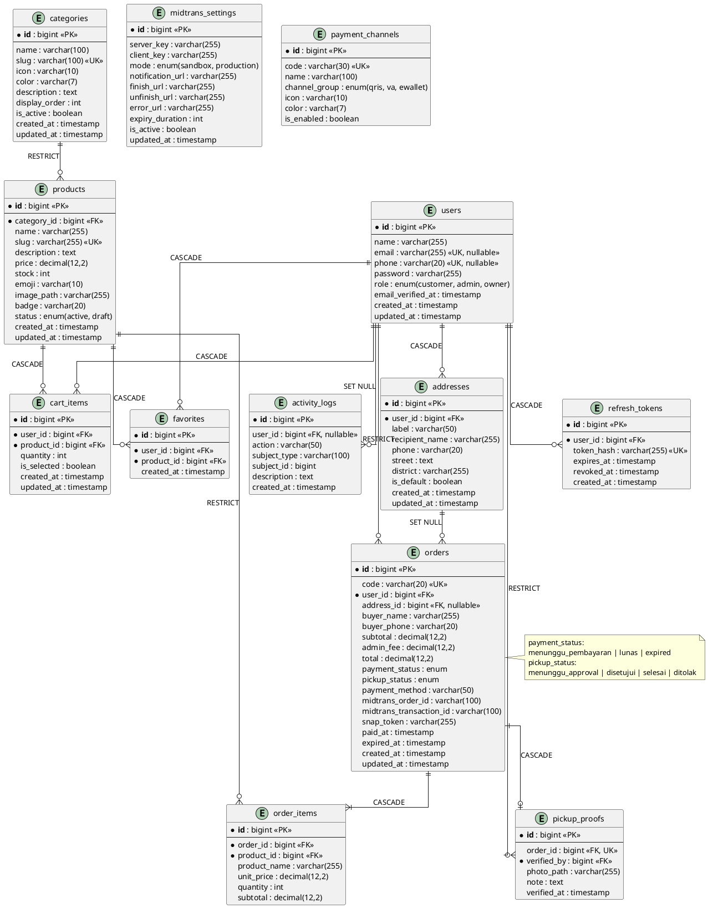
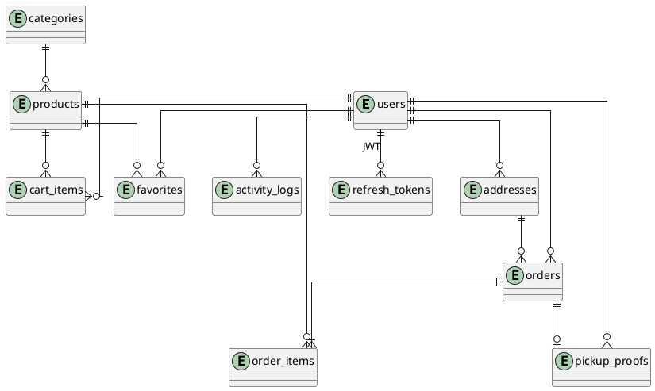
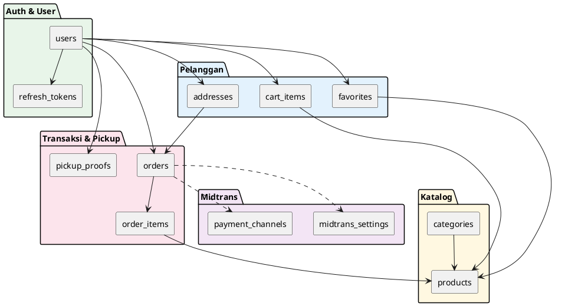
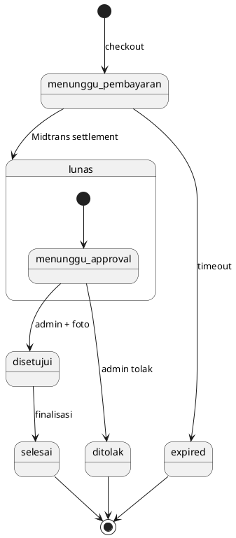
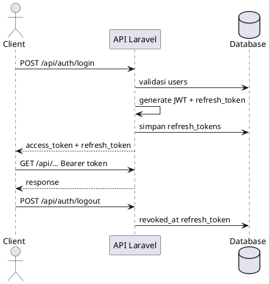
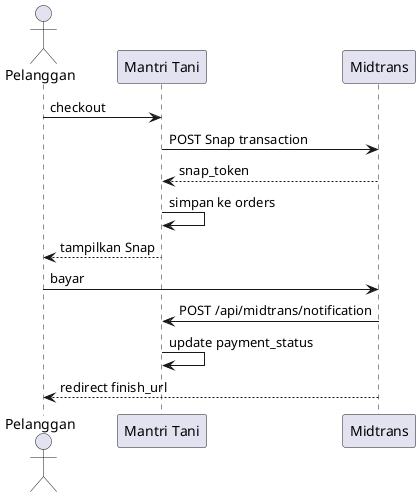

# ERD Mantri Tani — PlantUML

File ini berisi diagram ERD dalam format **PlantUML**, selaras dengan migration Laravel (`database/migrations/`).

**Versi:** 1.3 · **Tanggal:** 7 Juli 2026

> **Fix Syntax Error:** `ERD.puml` sekarang **1 diagram saja**. Diagram lain ada di folder [`diagrams/`](diagrams/). Jangan paste banyak `@startuml` sekaligus ke plantuml.com.

---

## Cara render

| Tool | Cara pakai |
|------|------------|
| [PlantUML Online](https://www.plantuml.com/plantuml/uml) | Copy seluruh isi `ERD.puml` → paste |
| VS Code / Cursor | Install extension **PlantUML** → Alt+D preview |
| IntelliJ / PhpStorm | Plugin PlantUML integration |
| CLI | `java -jar plantuml.jar planning/ERD.puml` → export PNG/SVG |
| draw.io | Arrange → Insert → Advanced → PlantUML |

**File sumber:** [`ERD.puml`](ERD.puml) · diagram lain: [`diagrams/`](diagrams/)

---

## 1. Diagram Relasi Utama (13 tabel)

---

## 2. Diagram Ringkas (hanya relasi)

---

## 3. Alur Modul (component)

---

## 4. Lifecycle Order (state)

---

## 5. Alur JWT Auth (sequence)

---

## 6. Alur Midtrans Snap (sequence)

---

## 7. Ringkasan relasi & ON DELETE

| Parent | Child | Kardinalitas | ON DELETE |
|--------|-------|--------------|-----------|
| users | refresh_tokens | 1:N | CASCADE |
| users | addresses | 1:N | CASCADE |
| users | cart_items | 1:N | CASCADE |
| users | orders | 1:N | RESTRICT |
| users | favorites | 1:N | CASCADE |
| users | activity_logs | 1:N | SET NULL |
| users | pickup_proofs | 1:N | RESTRICT |
| categories | products | 1:N | RESTRICT |
| products | cart_items | 1:N | CASCADE |
| products | order_items | 1:N | RESTRICT |
| products | favorites | 1:N | CASCADE |
| addresses | orders | 1:N | SET NULL |
| orders | order_items | 1:N | CASCADE |
| orders | pickup_proofs | 1:0..1 | CASCADE |

---

## 8. File terkait

| File | Fungsi |
|------|--------|
| `planning/ERD.md` | Dokumentasi lengkap + definisi kolom |
| `planning/ERD.puml` | **Source PlantUML** (semua diagram) |
| `planning/ERD.plantuml.md` | Dokumentasi ERD |
| `planning/FLOWCHART.puml` | Flowchart alur bisnis |
| `planning/FLOWCHART.plantuml.md` | Dokumentasi flowchart |
| `database/migrations/` | Implementasi schema di Laravel |
