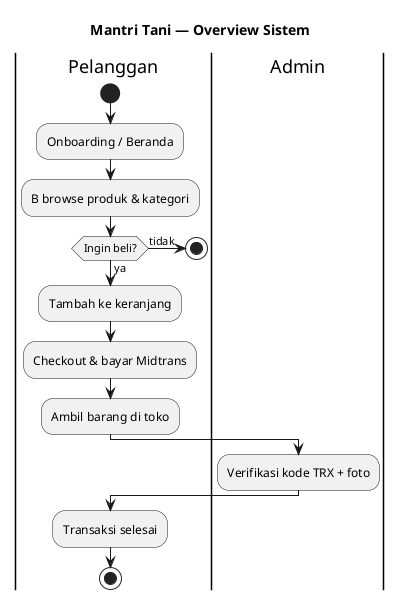

# Flowchart Mantri Tani — PlantUML

Flowchart alur bisnis aplikasi **Mantri Tani**, format PlantUML (activity diagram).

**Versi:** 1.0 · **Tanggal:** 7 Juli 2026

**File sumber:** [`planning/FLOWCHART.puml`](FLOWCHART.puml)

---

## Cara render

| Tool | Cara |
|------|------|
| [PlantUML Online](https://www.plantuml.com/plantuml/uml) | Copy blok `@startuml` … `@enduml` → paste |
| VS Code / Cursor | Extension **PlantUML** → Alt+D preview |
| CLI | `plantuml planning/FLOWCHART.puml` |

---

## Daftar diagram

| ID | Judul | Deskripsi |
|----|-------|-----------|
| `mantri-tani-system-overview` | Overview sistem | 3 role: pelanggan, admin, pickup |
| `mantri-tani-shopping-flow` | Belanja pelanggan | Browse → keranjang → login |
| `mantri-tani-checkout-payment` | Checkout & Midtrans | Order → Snap → webhook |
| `mantri-tani-pickup-approval` | Approval admin | Cari TRX → foto → verifikasi |
| `mantri-tani-auth-jwt` | Auth JWT | Register, login, refresh, logout |
| `mantri-tani-admin-catalog` | Kelola katalog | CRUD kategori & produk |
| `mantri-tani-midtrans-webhook` | Webhook Midtrans | Signature → update status |
| `mantri-tani-order-status-flow` | Status order | Decision tree payment + pickup |
| `mantri-tani-role-access` | Akses role | Customer / admin / owner |

---

## 1. Overview Sistem

> Diagram lengkap ada di `FLOWCHART.puml`

---

## 2. Belanja Pelanggan

Alur: beranda → detail → keranjang → login (jika perlu) → checkout.

---

## 3. Checkout & Pembayaran

Alur: buat order → Snap token → bayar → webhook → update status.

---

## 4. Approval Pengambilan

Alur: cari TRX → cek lunas → foto kamera → verifikasi/tolak.

---

## 5. Auth JWT

Alur: register / login / refresh / logout dengan `refresh_tokens`.

---

## File terkait

| File | Fungsi |
|------|--------|
| [`ERD.puml`](ERD.puml) | Entity + sequence + state |
| [`ERD.md`](ERD.md) | Dokumentasi database |
| [`FLOWCHART.puml`](FLOWCHART.puml) | **Flowchart (file ini)** |
